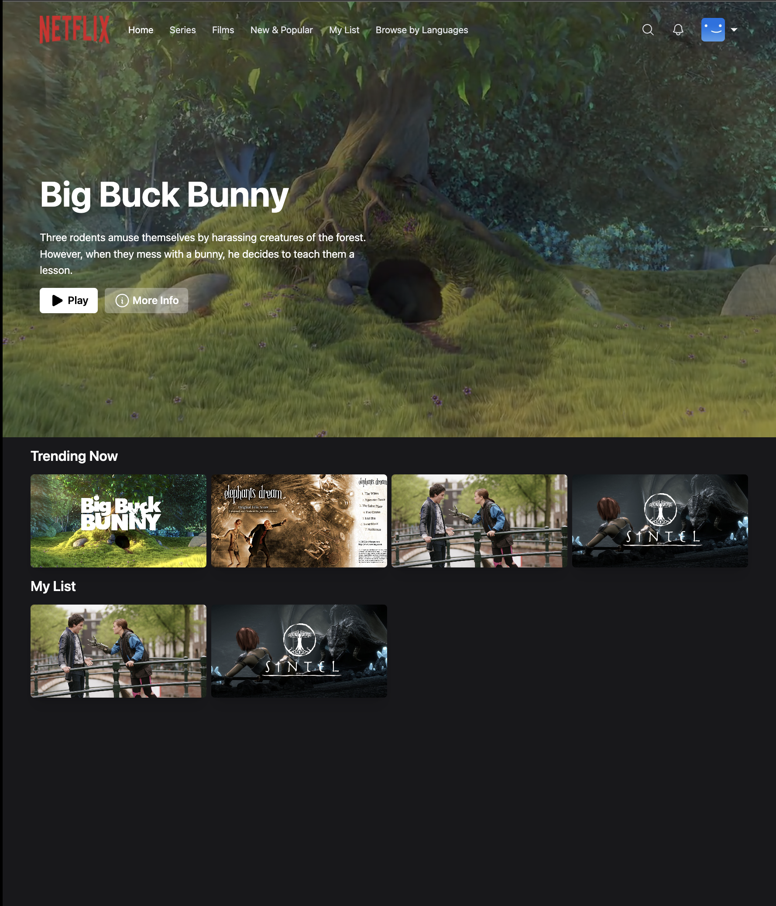

Netflix Clone

A Netflix clone project built with Next.js, React, MongoDB, Tailwind CSS, and NextAuth.js for authentication.

Table of Contents
Project Overview
Technologies Used
Features
Getting Started
Project Structure
Contributing
License
Project Overview
The Netflix Clone is a web application that replicates some of the core functionality of Netflix. It allows users to:

Browse and search for movies and TV shows.
View details of individual movies and TV shows.
Play trailers of selected content.
User authentication with NextAuth.js.
And more!
Demo: Link to Demo

Netflix Clone Demo

Technologies Used
Next.js: A React framework for building server-rendered React applications.
React: A JavaScript library for building user interfaces.
MongoDB: A NoSQL database for storing application data.
Tailwind CSS: A utility-first CSS framework for quickly designing web applications.
NextAuth.js: An authentication library for Next.js applications.
Features
User Authentication: Implement user authentication using NextAuth.js for secure access to the application.
Movie and TV Show Listings: Display a list of movies and TV shows fetched from the database.
Detailed Information: Allow users to view detailed information about a selected movie or TV show.
Trailer Playback: Enable users to play trailers for selected content.
Search Functionality: Implement a search feature to find movies and TV shows by title.
Responsive Design: Ensure the application is responsive and works seamlessly on various devices.
User Profiles: Enable users to create profiles, manage preferences, and continue watching.
Add to Watchlist: Allow users to add content to their watchlist.
Secure Authentication: Implement secure authentication practices to protect user data.
